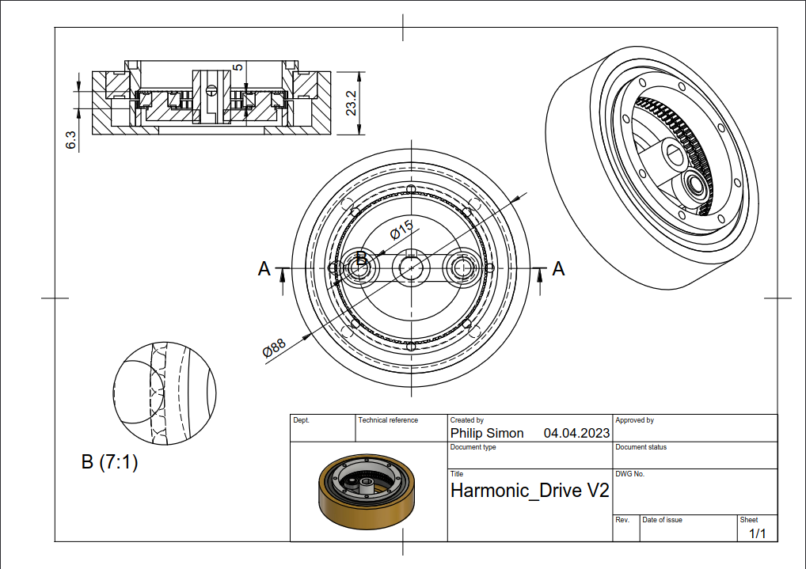

<h1 align="center">MATRS</h1>

<p align="center">


</p>

MATRS (Motion Actuated Turret Remote System) ist ein quelloffenes persönliches Projekt. Ein Miniatur-Geschütz folgt Handbewegungen und feuert auf Kommando.

<p align="center">

</p>

## Hintergrund

Was eigentlich nur ein Wochenend-Projekt zum wiederverwenden einiger Komponenten werden sollte, artete in mein wohl umfangreichstes Mechatronik Projekt aus. Vom Getriebe bis zum Handschuh habe ich so ziemlich alles entworfen, programmiert und fabriziert.

## Features

### Geschoss

MATRS feuert sechs Millimeter Airsoft BBs. Andere Größen könnten jedoch durch einfache Modifizierung am Lauf und Hopper benutzt werden.

### Modi

MATRS hat zwei programmierte Modi, welche mittels Knopfdruck am Handschuh ausgewählt werden können:

#### Stationärer Modus

In diesem Modus rotiert die Turret nicht. Lediglich der Abzug kann betätigt werden, um ein Geschoss abzufeuern.

#### Dynamischer Modus

Hier rotiert die Turret, sodass die Orientierung gleich dem des Handschuhs/Controllers ist (Gieren). Auch die Neigung (Nicken) des Handschuhs wird berücksichtigt.

## Umsetzung

### Gieren



Das Gieren des Geschützes übernimmt ein 39,5:1 **Spannungswellengetriebe**. Als _Flex-Spline_ wurde ein Zahnriemen vom Typ GT2 verwendet, welcher von zwei Kugellagern gespannt wird. Den Antrieb übernimmt in meiner Installation ein Nema 23 Schrittmotor (Closed-Loop), welcher zugegeben etwas überqualifiziert ist.

### Nicken

Das Nicken wird durch ein **Zahnriemengetriebe** mit einem Übersetzungsverhältnis von 3⅓:1 realisiert. Als Antrieb habe ich einen SG90 Mikroservo benutzt. Des weiteren sorgt ein Idler mit einstellbarer Spannung für eine optimale Kraftübersetzung.

### Schießen

Den Schuss-Mechanismus habe ich in dieser Version nicht selbst entworfen. Es handelt sich um eine einfache Airsoft-Gearbox. Der durch die Gearbox freigelassene Luftdruck mündet in dem 3D-gedruckten vorderen Lauf. Die Kugeln werden hierbei von einem Trichter in den Lauf gefüllt.

### Bewegungserfassung

Das **AHRS** (_Attitude Heading Reference System_) wird mittels Sensor-Fusion eines 6-Achsen Beschleunigungssensor und Gyroskops inmitten des Handschuhs umgesetzt. Ein Arduino Nano 33 BLE sorgt für die Beschaffung und Verarbeitung dieser Informationen. Eine **Kalibrierung** und **Homing-Prozedur** direkt nach dem Verbindungsaufbau zwischen Handschuh und Geschütz sorgt für zuverlässige, konstante Nutzung.

### Drahtlose Kommunikation

Des weiteren ist dank des verbauten Chipsets Bluetooth® Low Energy und somit eine kabellose Kommunikation zwischen Controller (Handschuh) und Turret möglich. Die Kalibrierung, das Homing, wie die Auswahl der verschiedenen Modi erfolgt über einen Taster am Handschuh. Zudem erzeugt die Basisstation der Turret Audio-Signale zu bestimmten Ereignissen (wie z.B. beim Wechsel des Modus) und eine LED im Handschuh liefert Einblick in den Zustand der Kommunikation. So bedeutet ein blinkendes Signal bspw. das Daten für die Kalibrierung gesammelt werden.

Es gibt einen **BLE-Service** mit folgenden Charakteristiken:

```cpp
BLECharacteristic headingInt("b3de23b1-12fe-4266-a590-53528c11116d", BLERead, 3);
BLEIntCharacteristic buttonPress("6541935a-5c22-464b-b150-c335eaa92910", BLERead | BLEWrite | BLENotify);
BLEIntCharacteristic triggerPull("626488b2-70d1-4b89-ad13-45e8ee61ebd8", BLERead | BLENotify);
```

Wobei `headingInt` aus drei Byte besteht (platzbedingt, da z.B. 359 (°) > 255):

- Byte 1 und 2 für die Gierungsrichtung
- Byte 3 für das Nicken

Der Nano 33 BLE des Handschuhs macht dabei Gebrauch vom MBED basierten RTOS (_Real Time Operating System_) und implementiert **Multithreading** um die verschiedenen Charakteristiken gleichzeitig aktualisieren zu können.

## Hürden

### AHRS

Ursprüngliche Versuche die Sensor-Daten zu Fusionieren fanden im Zahlenbereich der Quaternionen statt. Letztendlich waren normale Euler-Winkel leichter umzusetzen. Da ein Gimbal-Lock für den Betrieb des Systems irrelevant scheint, ist diese Lösung pragmatischer.

Um Störungen im Input der Sonseren zu reduzieren wird entweder ein simpler Low-Pass Filter angewendet:

```cpp
EulerAngles calcLowPassAngles() {
   EulerAngles angles = calcHeading();

   float pitchf = angles.pitch * 0.25 + (pitchf * (1.0 - 0.25));
   float rollf = angles.roll * 0.25 + (rollf * (1.0 - 0.25));
   float yawf = angles.yaw * 0.25 + (yawf * (1.0 - 0.25));

   return {pitchf, rollf, yawf};
}
```

... oder wie in der derzeitigen Version lediglich die arithmetischen Mittel verwertet:

```cpp
EulerAngles calcAverageAngles() {
   int N = 16;
   float averPitch=0; float averRoll=0; float averYaw=0;
   for (int i=1;i<=N;i++)
   {
      EulerAngles angles = calcHeading();
      averPitch += angles.pitch; averRoll += angles.roll; averYaw += angles.yaw;
   }
   averPitch /= N;    averRoll /= N;  averYaw /= N;

   return {averPitch, averRoll, averYaw};
}
```

### Asynchronizität

Anfangs war für die Kontrolle der Basisstation lediglich ein Arduino Nano 33 BLE vorgesehen. Dieser sollte Kommunikation und Steuerung des Geschützes vornehmen (Gieren & Nicken). Diese Realisierung stellte sich jedoch schnell als unpraktisch heraus. Die Limitierung ergab sich aus der ungenügenden Spannung der digitalen Pins des Nanos für die Steuerung des Schrittmotor-Treibers. Daher wurden die Steuerungsaufgaben auf einen zusätzlichen Arduino Mega umgelegt. Der Arduino Nano der Basisstation übernimmt also lediglich Kommunikationsaufgaben.

Die eingehenden AHRS Daten des Handschuhs übermittelt der Arduino Nano der Basisstation an den Arduino Mega via serieller Schnittstelle.

### Stromversorgung

Die Stromversorgung war das irreführendste Problem. Die Rede ist hierbei von der Stromversorgung der Airsoft Gearbox. Ursprünglich versuchte ich die Stromzufuhr mittels diverser MOSFETs zu switchen. Diese schienen jedoch nie vollständig zu leiten, obwohl die Schwellenspannung lange durch den Arduino MEGA überschritten wurde. Trotz der Spannungs-bestimmten Natur, schienen die MOSFETs aufgrund einer zu geringen Stromstärke geöffnet. Diese Vermutung bestätigte sich nach multiplen Tests mit einer externen Stromversorgung bei gleicher Spannung, aber größerer Stromstärke. Nach vielen Tests entschied ich mich für das Switchen der Gearbox durch ein Relay. Dieses war nun in der Lage verlässlich den benötigten Strom für die Airsoft Gearbox zu schalten.

### Mündungsgeschwindigkeit

Die Schnelligkeit des Projektils ist proportional zum Luftdruck, welcher auf das Projektil wirkt. Jenen Druck gilt es also zu erhöhen, um eine möglichst große Projektilgeschwindigkeit zu verursachen. Um einen konstanten, hohen Druck erzeugen zu können, muss die Toleranz zwischen Kugel/Projektil und Lauf so gering wie möglich sein. Da der Lauf jedoch wie der Rest von MATRS per FDM hergestellt wurde, waren die Ergebnisse sehr volatil. Das Problem konnte größtenteils durch eine nachträgliche Bohrung, sowie Trial-and-Error gelöst werden.

## Weiterführendes

Der ganze Artikel über das Projekt steht auf meiner <a href="https://philipsi.de">Portfolio Website</a> zur Verfügung. In diesem finden Sie neben einer Hardware Liste auch Demonstrationsvideos uvm.!
